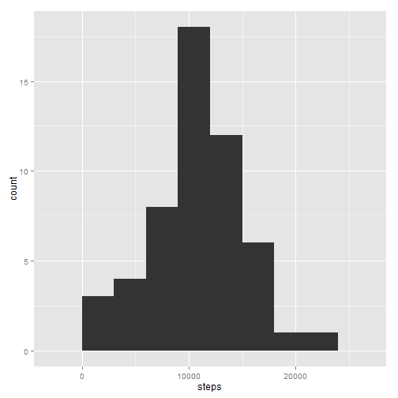
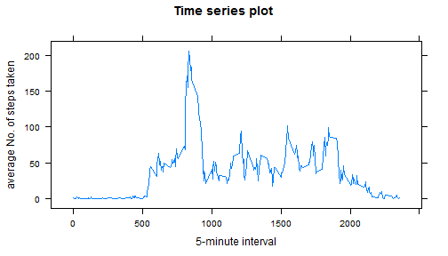
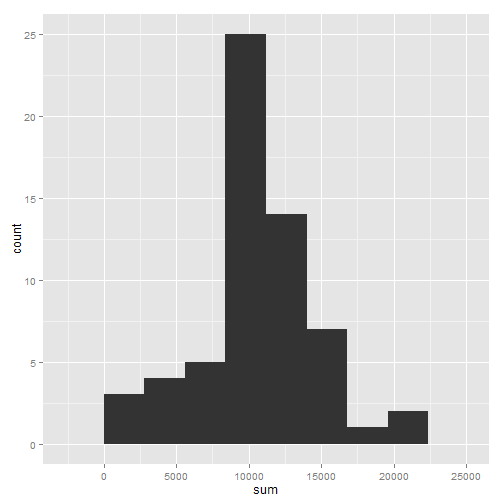
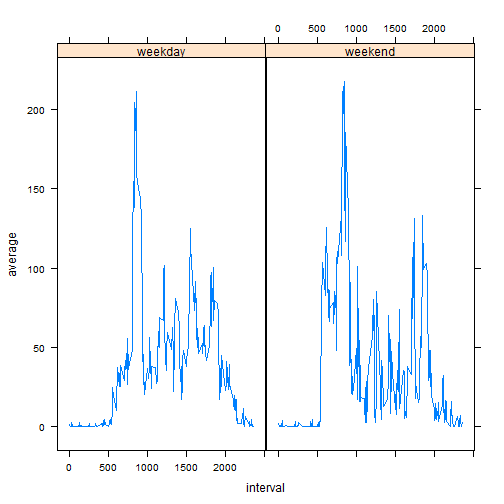

Peer Assessment 1
===================
## Loading and preprocessing the data

```r
activityData <- read.csv("./activity.csv")
str(activityData)
```

```
## 'data.frame':	17568 obs. of  3 variables:
##  $ steps   : int  NA NA NA NA NA NA NA NA NA NA ...
##  $ date    : Factor w/ 61 levels "2012-10-01","2012-10-02",..: 1 1 1 1 1 1 1 1 1 1 ...
##  $ interval: int  0 5 10 15 20 25 30 35 40 45 ...
```

Change the **date** variable from *'factor'* class to *'date'* class.

```r
class(activityData$date)
```

```
## [1] "factor"
```

```r
activityData$date <- as.Date(activityData$date, "%Y-%m-%d")
class(activityData$date)
```

```
## [1] "Date"
```
## What is mean total number of steps taken per day?

1. Make a histogram of the total number of steps taken each day


Firstly, load the **dplyr** package and exclude the rows with missing values:

```r
library(dplyr)
```

```
## 
## Attaching package: 'dplyr'
## 
## The following objects are masked from 'package:stats':
## 
##     filter, lag
## 
## The following objects are masked from 'package:base':
## 
##     intersect, setdiff, setequal, union
```

```r
activityData1 <- activityData[complete.cases(activityData),]
```


Then group data by **date** and sum the number of steps.

```r
suma <- group_by(activityData1, date) %>% summarise(steps = sum(steps, na.rm = T))
library(ggplot2)
ggplot(suma, aes(x=steps)) + geom_histogram(binwidth = 3000)
```

 

2. Calculate and report the mean and median total number of steps taken per day

```r
mean.median <- group_by(activityData1, date) %>% summarise(mean = mean(steps, na.rm = T), median = median(steps))
mean.median
```

```
## Source: local data frame [53 x 3]
## 
##          date     mean median
## 1  2012-10-02  0.43750      0
## 2  2012-10-03 39.41667      0
## 3  2012-10-04 42.06944      0
## 4  2012-10-05 46.15972      0
## 5  2012-10-06 53.54167      0
## 6  2012-10-07 38.24653      0
## 7  2012-10-09 44.48264      0
## 8  2012-10-10 34.37500      0
## 9  2012-10-11 35.77778      0
## 10 2012-10-12 60.35417      0
## ..        ...      ...    ...
```

## What is the average daily activity pattern?

1. Make a time series plot (i.e. type = "l") of the 5-minute interval (x-axis) and the average number of steps taken, averaged across all days (y-axis)

```r
intervalo <- group_by(activityData1, interval) %>% summarise(average = mean(steps))
library(lattice)
xyplot(average ~ interval, data = intervalo, type = "l", xlab = "5-minute interval", ylab = "average No. of steps taken", main = "Time series plot")
```

 


2. Which 5-minute interval, on average across all the days in the dataset, contains the maximum number of steps?

```r
intervalo$interval[which.max(intervalo$average)]
```

```
## [1] 835
```
The *835th* 5-minute interval contains the maximum number of steps on average.

## Imputing missing values

1. Calculate and report the total number of missing values in the dataset (i.e. the total number of rows with NAs)

```r
table(is.na(activityData))
```

```
## 
## FALSE  TRUE 
## 50400  2304
```
Which means that  2304 rows have NAs


2. Devise a strategy for filling in all of the missing values in the dataset. The strategy does not need to be sophisticated. For example, you could use the mean/median for that day, or the mean for that 5-minute interval, etc.


I create a variable called *alpha* that replace the original rows with NAs for values that have the interval averages calculated in the previous section.

```r
alpha <- is.na(activityData$steps) * intervalo$average
```

3. Create a new dataset that is equal to the original dataset but with the missing data filled in.


First, I replace the rows with NAs, in the original dataset, with the value zero. 

```r
activityData$steps[is.na(activityData$steps)] = 0
head(activityData)
```

```
##   steps       date interval
## 1     0 2012-10-01        0
## 2     0 2012-10-01        5
## 3     0 2012-10-01       10
## 4     0 2012-10-01       15
## 5     0 2012-10-01       20
## 6     0 2012-10-01       25
```
Then I create a variable call **steps_noNA** that is the sum of the *steps* column with *alpha* to replace the NA values with the averages of the 5-minutes interval.

```r
activityData$steps_noNA <- activityData$steps + alpha
head(activityData)
```

```
##   steps       date interval steps_noNA
## 1     0 2012-10-01        0  1.7169811
## 2     0 2012-10-01        5  0.3396226
## 3     0 2012-10-01       10  0.1320755
## 4     0 2012-10-01       15  0.1509434
## 5     0 2012-10-01       20  0.0754717
## 6     0 2012-10-01       25  2.0943396
```

4. Make a histogram of the total number of steps taken each day and Calculate and report the mean and median total number of steps taken per day. Do these values differ from the estimates from the first part of the assignment? What is the impact of imputing missing data on the estimates of the total daily number of steps?


```r
sumsNA <- group_by(activityData, date) %>% summarise(sum = sum(steps_noNA, na.rm = T))
ggplot(sumsNA, aes(x=sum)) + geom_histogram(binwidth = 2800)
```

 

```r
mean.median.NA <- group_by(activityData, date) %>% summarise(mean = mean(steps_noNA, na.rm = T), median = median(steps_noNA))
mean.median.NA
```

```
## Source: local data frame [61 x 3]
## 
##          date     mean   median
## 1  2012-10-01 37.38260 34.11321
## 2  2012-10-02  0.43750  0.00000
## 3  2012-10-03 39.41667  0.00000
## 4  2012-10-04 42.06944  0.00000
## 5  2012-10-05 46.15972  0.00000
## 6  2012-10-06 53.54167  0.00000
## 7  2012-10-07 38.24653  0.00000
## 8  2012-10-08 37.38260 34.11321
## 9  2012-10-09 44.48264  0.00000
## 10 2012-10-10 34.37500  0.00000
## ..        ...      ...      ...
```

The histogram remains invariable relative to the first histogram with no NAs. The impact is relatively small, as the only change seems to be the median from some days.


## Are there differences in activity patterns between weekdays and weekends?

1. Create a new factor variable in the dataset with two levels -- "weekday" and "weekend" indicating whether a given date is a weekday or weekend day.


```r
beta <- weekdays(activityData$date)
activityData <- mutate(activityData, week = factor(1 * (weekdays(activityData$date) > "Thursday"), labels = c("weekday", "weekend"))) 
head(activityData)
```

```
##   steps       date interval steps_noNA    week
## 1     0 2012-10-01        0  1.7169811 weekday
## 2     0 2012-10-01        5  0.3396226 weekday
## 3     0 2012-10-01       10  0.1320755 weekday
## 4     0 2012-10-01       15  0.1509434 weekday
## 5     0 2012-10-01       20  0.0754717 weekday
## 6     0 2012-10-01       25  2.0943396 weekday
```

```r
activityData[345:330,]
```

```
##     steps       date interval steps_noNA    week
## 345     0 2012-10-02      440          0 weekend
## 344     0 2012-10-02      435          0 weekend
## 343     0 2012-10-02      430          0 weekend
## 342     0 2012-10-02      425          0 weekend
## 341     0 2012-10-02      420          0 weekend
## 340     0 2012-10-02      415          0 weekend
## 339     0 2012-10-02      410          0 weekend
## 338     0 2012-10-02      405          0 weekend
## 337     0 2012-10-02      400          0 weekend
## 336     0 2012-10-02      355          0 weekend
## 335     0 2012-10-02      350          0 weekend
## 334     0 2012-10-02      345          0 weekend
## 333     0 2012-10-02      340          0 weekend
## 332     0 2012-10-02      335          0 weekend
## 331     0 2012-10-02      330          0 weekend
## 330     0 2012-10-02      325          0 weekend
```
2. Make a panel plot containing a time series plot (i.e. type = "l") of the 5-minute interval (x-axis) and the average number of steps taken, averaged across all weekday days or weekend days (y-axis).


```r
activityData2 <- group_by(activityData, interval, week) %>% summarise(average = mean(steps_noNA))
xyplot(average ~ interval | week, data = activityData2, type = "l")
```

 
